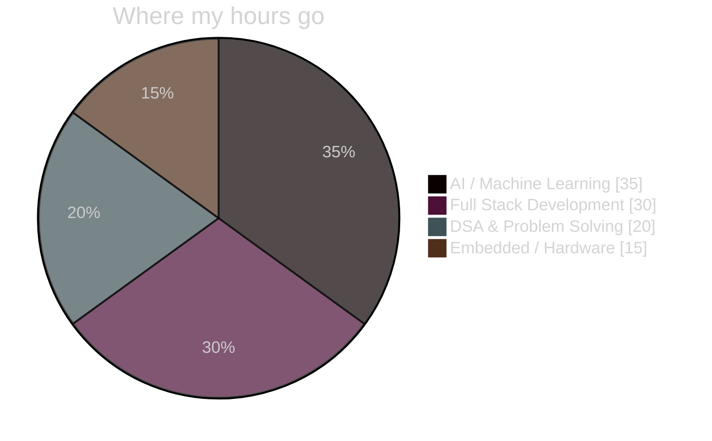
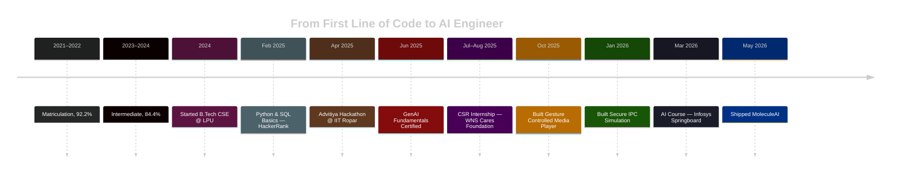

 

 

## 🪄 About Me

- 🔭 Currently building **MoleculeAI** — predicting molecular properties with ML/DL
- 🌱 Deepening my knowledge of **Transformers**, **NLP** & **System Design**
- 🎓 B.Tech CSE @ **Lovely Professional University** — CGPA **8.94**
- ⚡ Fun fact: I've simulated OS-level IPC *and* controlled a media player with hand gestures
- 📫 Reach me at **priyanshupal081206@gmail.com**
- 🎯 Open to **Software Engineering**, **AI/ML Engineer**, and **Research** roles

 

## 🧬 Skill Radar

## 🗺️ Journey So Far

## 🧩 Featured Builds

<table align="center" width="100%">
<tr>
<td width="33%" valign="top" align="center">

### MoleculeAI
Predicting molecular toxicity & solubility with ML/DL.

`Python` `TensorFlow` `RDKit` `XGBoost`
**May 2026**
</td>
<td width="33%" valign="top" align="center">

### Secure IPC
Interactive OS-level IPC mechanism simulator.

`HTML` `CSS` `JavaScript`
**Jan 2026**
</td>
<td width="33%" valign="top" align="center">

### Gesture Media Player
Touch-free media control via Arduino + ultrasonic sensors.

`Arduino` `PySerial`
**Oct 2025**
</td>
</tr>
</table>

## 📡 Live GitHub Signal

## 🐍 Contribution Snake

## 🏆 Certifications & Recognition

## 💬 Let's Build Something

I'm most excited by problems where **AI meets real-world impact**. If that's you too, let's talk.

  

