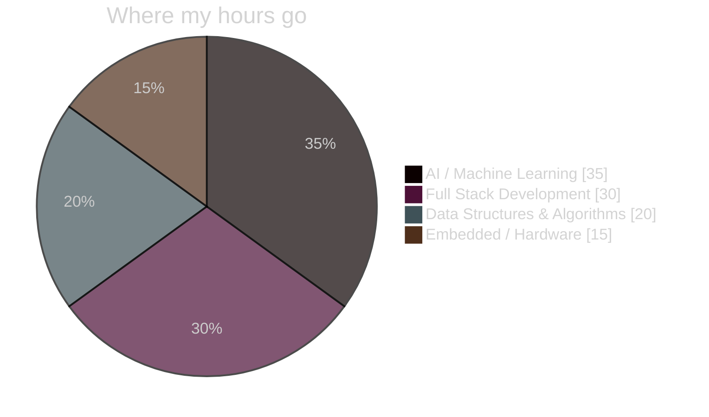
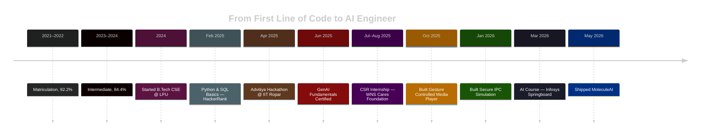

 

  

 

## ⚡ At a Glance

<table align="center">
<tr>
<td width="25%" align="center">

**🎓 CGPA**
<h3>8.94</h3>

</td>
<td width="25%" align="center">

**🏗️ Projects**
<h3>3+</h3>

</td>
<td width="25%" align="center">

**🧪 Focus**
<h3>AI/ML</h3>

</td>
<td width="25%" align="center">

**📍 Based in**
<h3>Punjab, IN</h3>

</td>
</tr>
</table>

---

## 🧬 Skill Distribution

## 🗺️ Engineering Journey

---

## 🛠️ Tech Stack

<table>
<tr>
<td valign="top" width="50%">

**Languages**

**Frontend**

</td>
<td valign="top" width="50%">

**AI / ML**

**Tools**

</td>
</tr>
</table>

---

## 🧩 Featured Builds

<table align="center" width="100%">
<tr>
<td width="33%" valign="top">

### 🧬 MoleculeAI
Neural synthesis engine predicting molecular toxicity & solubility.

`Python` `TensorFlow` `RDKit` `XGBoost`

**May 2026**

</td>
<td width="33%" valign="top">

### 🔐 Secure IPC
Interactive OS-level Inter-Process Communication simulator.

`HTML` `CSS` `JavaScript`

**Jan 2026**

</td>
<td width="33%" valign="top">

### 🎮 Gesture Media Player
Touch-free multimedia control via Arduino + ultrasonic sensors.

`Arduino` `PySerial`

**Oct 2025**

</td>
</tr>
</table>

Click into individual repos on <a href="https://github.com/Priyanshupal08">GitHub</a> for full source & docs.

---

## 📡 Live GitHub Signal

---

## 🎖️ Certifications & Recognition

---

## 💬 Let's Build Something

I'm most excited by problems where **AI meets real-world impact** — molecular science, intelligent tooling, or products people actually use. If that's you too, let's talk.

  

