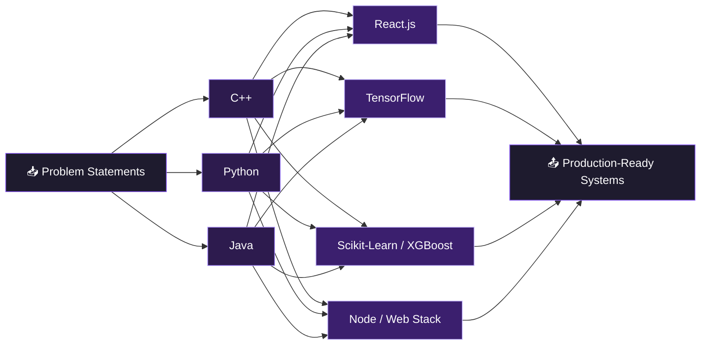

<div align="center">


<br/>

`Model Type: Full-Stack Engineer + AI/ML Specialist` &nbsp;|&nbsp; `License: open-to-work` &nbsp;|&nbsp; `Version: 2026.05`

</div>

<br/>

# 🗂️ Model Card: Priyanshu Pal

> A general-purpose engineering model fine-tuned on real-world problems, optimized for AI/ML systems and full-stack product delivery. Trained continuously since 2024, currently in active deployment.

<table align="center">
<tr><td><b>Developed by</b></td><td>Priyanshu Pal</td></tr>
<tr><td><b>Base institution</b></td><td>Lovely Professional University — B.Tech CSE</td></tr>
<tr><td><b>Training accuracy</b></td><td>8.94 / 10 CGPA</td></tr>
<tr><td><b>Primary languages</b></td><td>C++, Python, Java</td></tr>
<tr><td><b>Specializations</b></td><td>Machine Learning · Deep Learning · Full-Stack Development · NLP</td></tr>
<tr><td><b>Contact endpoint</b></td><td>priyanshupal081206@gmail.com</td></tr>
</table>

---

## 🧠 Architecture

<div align="center">



</div>

## 🔄 Training Lifecycle

<div align="center">

```mermaid
stateDiagram-v2
    [*] --> Learning
    Learning --> Building: apply knowledge
    Building --> Testing: ship v0.1
    Testing --> Deploying: passes eval
    Deploying --> Learning: new challenge found
    Deploying --> [*]: goal achieved

    classDef default fill:#1e1b2e,stroke:#8B5CF6,color:#fff
```

</div>

---

## 📊 Evaluation Results

<div align="center">

| Benchmark | Metric | Score |
|---|---|---|
| Academic Performance | CGPA (LPU) | **8.94 / 10** |
| Advitiya Hackathon — IIT Ropar | Tracks Cleared | AI Fusion · Code Hunt · Math Arena · CTF |
| WNS Cares Foundation | CSR Internship | Completed — Jul–Aug 2025 |
| Infosys Springboard | AI Certification | Passed — Mar 2026 |
| GenAI Fundamentals | Certification | Passed — Jun 2025 |
| HackerRank | Python & SQL Basics | Certified — Feb 2025 |

</div>

## 📦 Training Data (Background)

```yaml
matriculation:
  institution: Singhania Educational Institute
  score: 92.2%
  year: 2021-2022

intermediate:
  institution: Singhania Educational Institute
  score: 84.4%
  year: 2023-2024

undergraduate:
  institution: Lovely Professional University
  program: B.Tech, Computer Science & Engineering
  cgpa: 8.94
  status: in_progress (2024 - present)
```

---

## 🚀 Deployments (Featured Projects)

<div align="center">

| Deployment | Environment | Status | Version |
|---|---|---|---|
| **MoleculeAI** — molecular toxicity & solubility prediction | Research / ML Pipeline | 🟢 Live | v1.0 · May 2026 |
| **Secure IPC** — inter-process communication simulator | Educational / Web | 🟢 Live | v1.0 · Jan 2026 |
| **Gesture Controlled Media Player** | Embedded / Hardware | 🟢 Live | v1.0 · Oct 2025 |

</div>

<details>
<summary><b>🔍 Inspect deployment: MoleculeAI</b></summary>
<br/>

**Stack:** Python · TensorFlow · Scikit-Learn · React.js · Tailwind CSS · RDKit · XGBoost
**Description:** Predicts molecular toxicity and solubility from SMILES-notation input using engineered molecular descriptors, benchmarked across Random Forest, XGBoost, and transformer-based architectures.

</details>

<details>
<summary><b>🔍 Inspect deployment: Secure IPC</b></summary>
<br/>

**Stack:** HTML · CSS · JavaScript
**Description:** Simulates message routing, shared memory, and process lifecycle management with an interactive interface for visualizing OS-level process communication.

</details>

<details>
<summary><b>🔍 Inspect deployment: Gesture Controlled Media Player</b></summary>
<br/>

**Stack:** Arduino IDE · Python (PySerial) · Arduino Uno · Ultrasonic Sensors
**Description:** Touch-free media control — play, pause, volume, and track navigation — through real-time gesture recognition and hardware-software serial communication.

</details>

---

## ⚠️ Limitations & Notes

```diff
+ Performs best under real deadlines and genuine problem constraints
+ Strong generalization across ML, web, and embedded domains
- May occasionally over-optimize side projects at 2 AM
! Requires coffee for peak inference speed ☕
```

---

## 📡 Live Inference Metrics

<div align="center">


</div>

---

## 📖 How to Cite This Model

```bibtex
@engineer{pal2026priyanshu,
  author       = {Priyanshu Pal},
  title        = {Full-Stack Engineer and AI/ML Specialist},
  institution  = {Lovely Professional University},
  year         = {2026},
  note         = {Actively accepting collaboration and hiring requests}
}
```

## 🔌 API Endpoints (Contact)

```bash
# Reach out via email
curl -X POST https://contact.priyanshu.dev \
  -d '{"channel": "email", "address": "priyanshupal081206@gmail.com"}'

# Connect on LinkedIn
curl -X GET https://linkedin.com/in/priyanshu-pal2006

# View source code
curl -X GET https://github.com/Priyanshupal08
```

<div align="center">

<br/>

[](mailto:priyanshupal081206@gmail.com)
[](https://linkedin.com/in/priyanshu-pal2006)
[](https://github.com/Priyanshupal08)

<br/>

*model.status = "actively accepting new challenges"*


</div>
